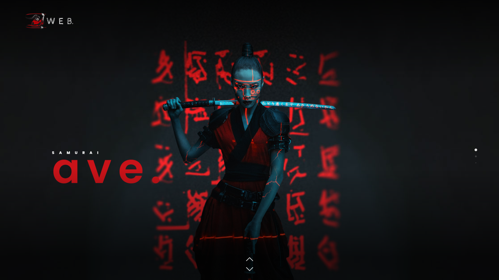
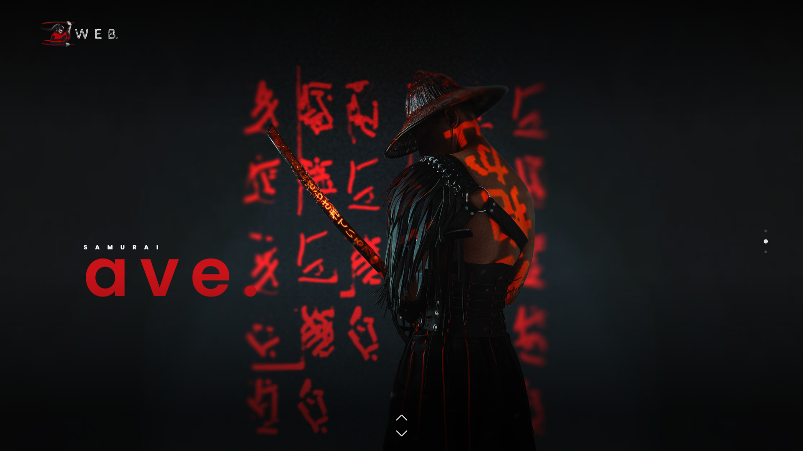
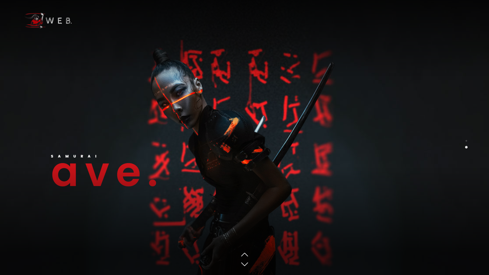

  
  
  
  

   
   

  <h2 align="center">Samurai website</h2>

  Samurai is a fully responsive website,  Responsive for all devices, build using HTML, CSS, and JavaScript.

  <a href="https://adnan-bhaldar.github.io/Samurai/"><strong>➥ Live Demo</strong></a>

 

### Demo Screeshots

### Contact

If you want to contact with me you can reach me at [Twitter](https://www.twitter.com/Adnan__Bhaldar).

### License

This project is **free to use** and does not contains any license.
